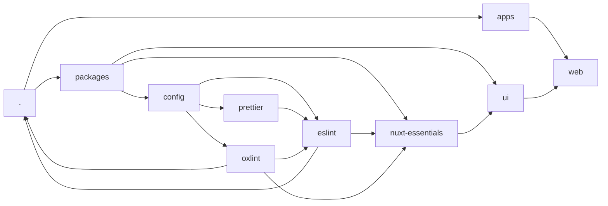

<div align="center">
  <h1><b>Ställning</b></h1>
  <span><i>[ˈstɛlː.nɪŋ]</i>: meaning "scaffold" in swedish</span>

  
</div>

## About the Project

This boilerplate serves as a foundation for building future projects. Feel free to utilize it for your own needs.

## Features

- **Monorepo Architecture**: Organized with PNPM workspaces and accelerated with Turborepo.
- **Multiple Templates**: Choose from a minimal setup or a full-fledged Nuxt application.
- **Code Quality**: Comes with ESLint, Prettier, and commit linting configured out-of-the-box.
- **Automation**: Husky for pre-commit hooks and Changesets for automated versioning and changelogs.
- **Modern Tech**: Built with TypeScript, Nuxt, and other modern technologies.

## Monorepo Structure

```sh
.
├── apps/
│   └── web
└── packages/
    ├── config/
    │   ├── eslint
    │   ├── oxlint
    │   └── prettier
    ├── ui
    └── nuxt-essentials
```



## Templates

A variety of templates are available, ranging from minimal (main branch) to technology-focused. Explore each branch to find the one that best suits your needs.

### Available Templates

- [minimal](https://github.com/Sioood/flovism/tree/minimal)
  - Minimal template configuration to get started with the essentials for any new project.
    - [Typescript](https://www.typescriptlang.org/)
    - [ESLint](https://eslint.org/)
    - [Prettier](https://prettier.io/)
    - [Husky](https://github.com/typicode/husky), [lint-staged](https://github.com/okonet/lint-staged) and [commitlint](https://github.com/conventional-changelog/commitlint)
    - [Changeset](https://github.com/changesets/changeset)
- [nuxt](https://github.com/Sioood/flovism/tree/nuxt)
  - A good starting point for Nuxt projects using Nuxt layers with separate UI.

## 🚧 Evolution

This boilerplate is intended to constantly evolve. So if you have any feedback or suggestions, please don't hesitate to reach out, or open an issue.

## 🚀 Get started

### Minimal prerequisites (Check package.json)

1. [**node**](https://nodejs.org/en/download) >=22.18.0
2. [**pnpm**](https://pnpm.io/installation) pnpm@10.14.0

```sh
npm install -g pnpm
```

3. [**git**](https://git-scm.com/download)

### 📦 Recommended extensions

You can install the recommended extensions defined in the `./.vscode/.code-workspace` file.

Go to [VSCode](https://code.visualstudio.com/) and open the extension tab, search for the recommended extensions by typing `@recommended` and install them.

### Commit Message Convention

This repository follows the [Conventional Commits](https://www.conventionalcommits.org/en/v1.0.0/) specification. Please make sure your commit messages adhere to this format.

The available scopes are: `global`, `config`, `nuxt-essentials`, `ui`, and `web`.
The available types are: `build`, `chore`, `ci`, `docs`, `feat`, `fix`, `perf`, `refactor`, `revert`, `style`, and `test`.

## Open workspace

Open the workspace file at `./.vscode/.code-workspace` to get started.

## Available Scripts

The following scripts are available at the root of the monorepo:

| Script                   | Description                            |
| ------------------------ | -------------------------------------- |
| `pnpm lint`              | Run all linting checks.                |
| `pnpm lint:oxlint`       | Run oxlint checks.                     |
| `pnpm lint:eslint`       | Run ESLint checks.                     |
| `pnpm i18n:coverage`     | Check i18n coverage.                   |
| `pnpm format`            | Format the codebase with Prettier.     |
| `pnpm changeset`         | Create a new changeset for versioning. |
| `pnpm changeset:release` | Create a release tag from changesets.  |
| `pnpm build`             | Build all packages and applications.   |

## 🛠️ Fetching the Latest Changes

If you want to stay up-to-date with the latest changes, you can pick either one or multiple commits.
I recommend using `git cherry-pick` to apply a specific commit from the remote repository to your local branch.
This ensures that you don't overwrite any changes you've made locally. And is not relative to a git history, `git cherry-pick` copies the changes from the selected commit to the current branch, with a new commit hash.

### 🍒 Cherry-Picking Commits

#### Storing the targeted branch temporary as `FETCH_HEAD`:

```sh
git fetch https://github.com/Sioood/flovism.git <target_branch>
```

#### Pick one commit:

```sh
git cherry-pick <commit_hash>
```

or

```sh
git cherry-pick FETCH_HEAD~<commit_index>
```

#### Pick a range of commits:

```sh
git cherry-pick <start_commit_hash>^..<end_commit_hash>
```

or

```sh
git cherry-pick FETCH_HEAD~<older_commit_index>^..FETCH_HEAD~<recent_commit_index>
```

### 🔎 Copying the changes of specific folder/files

#### Storing the targeted branch temporary as `FETCH_HEAD`:

```sh
git fetch https://github.com/Sioood/flovism.git <target_branch>
```

#### Copying the changes:

```sh
git checkout FETCH_HEAD -- <path_to_folder_or_file>
```
# flovism
# flovism
# flovism
